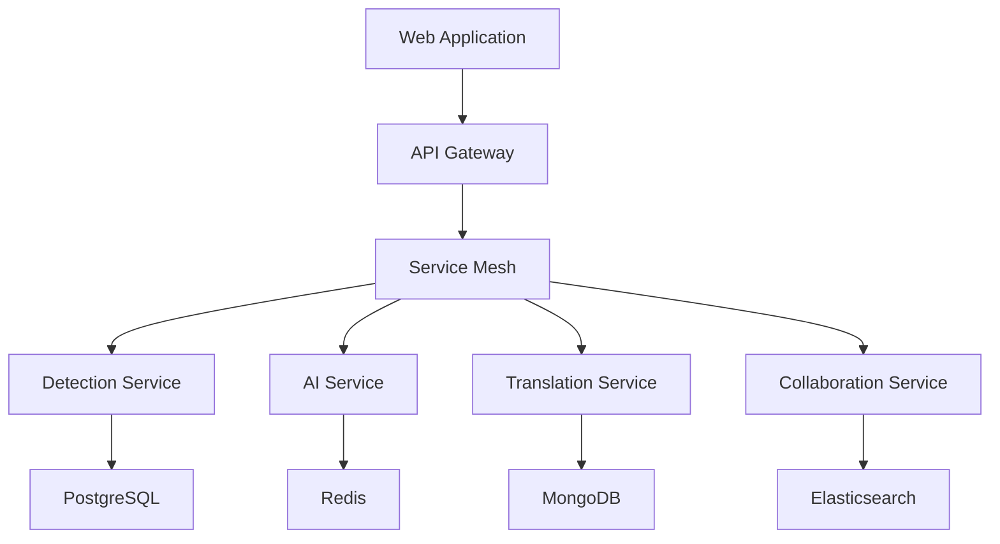

# AI-Powered Detection Platform

<!-- Generated with markdown-toc@1.2.0 -->
- [Overview](#overview)
- [System Architecture](#system-architecture)
- [Getting Started](#getting-started)
- [Development Guide](#development-guide)
- [Deployment](#deployment)

## Overview

The AI-Powered Detection Platform is a transformative solution for security teams that provides a collaborative environment for discovering, sharing, and generating detection content. Following a Product-Led Growth model similar to GitHub, the platform combines a free global detection library managed by AI with premium enterprise features.

### Key Features

- AI-driven detection content generation and optimization
- Cross-platform compatibility with major security platforms
- Collaborative community-driven detection sharing
- Enterprise-grade security and access controls
- Real-time validation and performance optimization

### Technology Stack

| Component | Technology | Version | Purpose |
|-----------|------------|---------|----------|
| Frontend | React | 18.2+ | User interface framework |
| API Gateway | Kong | Latest | API management and routing |
| Backend Services | Go | 1.21+ | Core service implementation |
| AI Services | Python | 3.11+ | ML model inference and training |
| Database | PostgreSQL | 15+ | Primary data storage |
| Cache | Redis | 7.2+ | Session and data caching |
| Search | Elasticsearch | 8.11+ | Content discovery |
| Message Bus | Apache Kafka | Latest | Event-driven communication |

## System Architecture

The platform follows a cloud-native microservices architecture designed for scalability and resilience.



### Service Components

- **API Gateway**: Request routing and rate limiting
- **Auth Service**: Identity and access management
- **Detection Service**: Core detection CRUD operations
- **AI Service**: ML model inference and training
- **Translation Service**: Cross-platform detection conversion
- **Collaboration Service**: Real-time collaboration features
- **Search Service**: Content discovery and analytics

## Getting Started

### Prerequisites

- Docker 24+
- Docker Compose
- Node.js 20 LTS
- Go 1.21+
- Python 3.11+
- Kubernetes 1.28+ (for production deployment)

### Local Development Setup

```bash
# Clone the repository
git clone https://github.com/organization/ai-detection-platform.git
cd ai-detection-platform

# Start infrastructure services
docker-compose up -d

# Install dependencies
npm install

# Start development server
npm run dev
```

### Service Ports

| Service | Port | Protocol | Purpose |
|---------|------|----------|---------|
| Frontend | 3000 | HTTP | Web application |
| API Gateway | 8000 | HTTP/gRPC | API routing |
| Auth Service | 8001 | gRPC | Authentication |
| Detection Service | 8002 | gRPC | Core functionality |
| AI Service | 8003 | gRPC | ML operations |

## Development Guide

### Project Structure

```
.
├── src/
│   ├── web/           # Frontend application
│   ├── backend/       # Backend services
│   ├── ai/            # AI/ML services
│   └── shared/        # Shared libraries
├── infrastructure/    # Infrastructure as code
├── deploy/           # Deployment configurations
└── docs/            # Additional documentation
```

### Coding Standards

- Follow language-specific style guides
- Implement comprehensive unit tests
- Document all public APIs
- Use conventional commits
- Maintain type safety

### Testing Strategy

1. Unit Tests: Jest for frontend, Go test for backend
2. Integration Tests: API and service integration
3. End-to-End Tests: Critical user flows
4. Performance Tests: Load and stress testing

## Deployment

### Infrastructure Provisioning

```bash
# Initialize Terraform
cd infrastructure
terraform init

# Plan deployment
terraform plan

# Apply changes
terraform apply
```

### Kubernetes Deployment

```bash
# Add Helm repositories
helm repo add ai-platform ./deploy/charts

# Install platform
helm install ai-platform ai-platform/platform \
  --namespace ai-platform \
  --create-namespace
```

### Monitoring Setup

- Prometheus for metrics collection
- Grafana for visualization
- Jaeger for distributed tracing
- ELK Stack for log aggregation

### CI/CD Pipeline

- GitHub Actions for automation
- ArgoCD for GitOps deployment
- Automated testing and security scanning
- Blue-green deployment strategy

## Contributing

Please refer to [CONTRIBUTING.md](CONTRIBUTING.md) for detailed guidelines on contributing to the project.

## License

This project is licensed under the MIT License - see the [LICENSE](LICENSE) file for details.