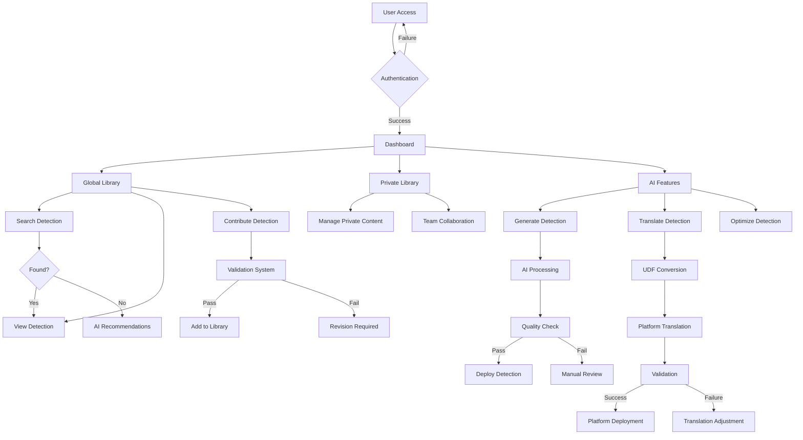
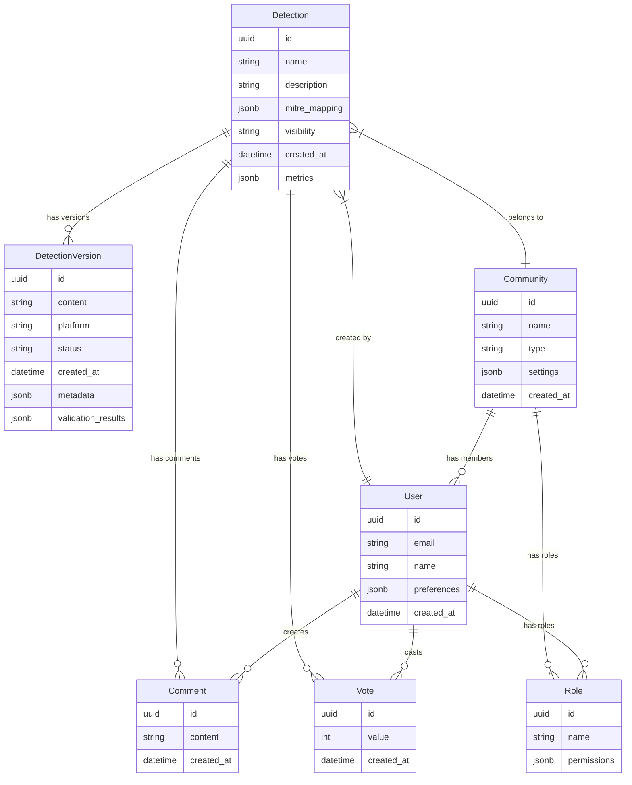
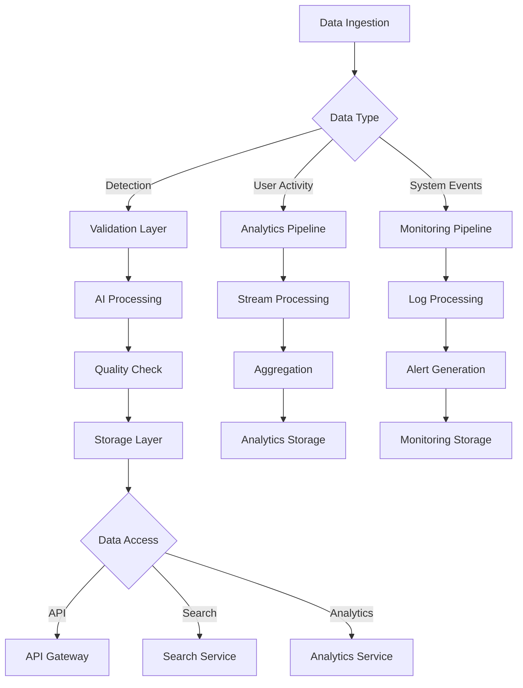

# Product Requirements Document (PRD)

# 1. INTRODUCTION

## 1.1 Purpose
This Software Requirements Specification (SRS) document provides a comprehensive description of the AI-Powered Detection Platform. It details the functional and non-functional requirements for developers, project managers, QA teams, and stakeholders involved in the development and deployment of the platform. This document serves as the primary reference for technical implementation and validation of the system requirements.

## 1.2 Scope
The AI-Powered Detection Platform is a cloud-native collaborative environment designed to revolutionize how security teams discover, share, and generate detection content. The system encompasses:

- A global detection library with AI-powered search capabilities
- Community-driven content sharing and collaboration features
- Premium AI-powered detection generation and optimization tools
- A Universal Detection Format (UDF) for cross-platform compatibility
- Enterprise-grade private library management features
- Direct integration with major security platforms

Key benefits include:
- Accelerated detection development through AI assistance
- Reduced false positives through community validation
- Streamlined cross-platform detection deployment
- Enhanced collaboration within security teams
- Automated detection optimization and translation

Core functionalities:
1. AI-Powered Search and Discovery
2. Detection Content Management
3. Community Collaboration Tools
4. Generative AI Detection Creation
5. Cross-Platform Detection Translation
6. Private Library Administration
7. Platform Integration Connectors
8. Analytics and Performance Monitoring

# 2. PRODUCT DESCRIPTION

## 2.1 Product Perspective
The AI-Powered Detection Platform operates as a cloud-native SaaS solution within the broader security operations ecosystem. The system interfaces with:

- Security Information and Event Management (SIEM) platforms
- Endpoint Detection and Response (EDR) systems
- Network Security Monitoring (NSM) tools
- Threat Intelligence Platforms (TIPs)
- Security Orchestration and Response (SOAR) platforms

The platform leverages modern cloud infrastructure with a microservices architecture, providing:

- Horizontal scalability for growing user bases
- Geographic distribution for global access
- High availability through redundant deployments
- Integration capabilities via REST APIs and GraphQL
- Real-time collaboration through WebSocket connections

## 2.2 Product Functions
1. Detection Content Management
   - Global detection library curation
   - Version control and change tracking
   - Metadata management and tagging
   - Quality scoring and validation

2. AI-Powered Capabilities
   - Natural language detection search
   - Automated detection generation
   - Cross-platform detection translation
   - Performance optimization suggestions

3. Collaboration Features
   - Public and private communities
   - Discussion threads and comments
   - Change request workflows
   - Contribution tracking

4. Enterprise Management
   - Private library administration
   - Role-based access control
   - Usage analytics and reporting
   - Custom workflow integration

5. Platform Integration
   - Direct deployment connectors
   - Real-time synchronization
   - Performance monitoring
   - Cross-platform validation

## 2.3 User Characteristics

| User Type | Technical Expertise | Primary Goals | Usage Patterns |
|-----------|-------------------|---------------|----------------|
| Security Analysts | Intermediate | Finding and implementing detections | Daily active usage, search-heavy |
| Security Engineers | Advanced | Creating and optimizing detections | Regular contributions, technical deep-dives |
| Security Leaders | Intermediate to Advanced | Strategy and oversight | Weekly reviews, analytics focus |
| Detection Contributors | Expert | Content creation and sharing | Frequent uploads, community engagement |
| Platform Administrators | Advanced | System management and configuration | Periodic maintenance, user management |

## 2.4 Constraints

### Technical Constraints
- Must maintain SOC 2 Type II compliance
- Platform-specific detection format limitations
- API rate limits for integrated services
- Real-time processing performance requirements
- Data residency requirements for certain regions

### Business Constraints
- Freemium model sustainability requirements
- Community content moderation scalability
- Premium feature differentiation needs
- Platform partnership dependencies
- Open-source licensing considerations

### Regulatory Constraints
- Data privacy compliance (GDPR, CCPA)
- Export control regulations
- Industry-specific compliance requirements
- Intellectual property protection
- Cross-border data transfer restrictions

## 2.5 Assumptions and Dependencies

### Assumptions
1. Users have basic security domain knowledge
2. Internet connectivity is consistently available
3. Modern web browsers are used for access
4. English is the primary platform language
5. Cloud infrastructure remains cost-effective

### Dependencies
1. External Services
   - Cloud infrastructure providers
   - Authentication services
   - CDN providers
   - Analytics platforms

2. Technology Components
   - AI/ML model training capabilities
   - Detection translation engines
   - Real-time collaboration systems
   - Search indexing services

3. Community Factors
   - Active user participation
   - Quality content contributions
   - Peer review engagement
   - Platform partnership cooperation

4. Development Resources
   - AI expertise availability
   - Security domain knowledge
   - Platform development skills
   - Quality assurance capabilities

# 3. PROCESS FLOWCHART

# 4. FUNCTIONAL REQUIREMENTS

## 4.1 Detection Content Management

### ID: F-DCM-001
### Description
Core functionality for managing the global and private detection libraries, including content organization, version control, and metadata management.
### Priority: P0
### Requirements

| ID | Requirement | Priority | Notes |
|----|-------------|----------|--------|
| DCM-1 | Support creation, reading, updating, and deletion of detection content | P0 | Must maintain audit trail |
| DCM-2 | Implement version control with branching and merging capabilities | P0 | Similar to Git workflow |
| DCM-3 | Provide metadata management including MITRE ATT&CK mappings | P0 | Must support batch updates |
| DCM-4 | Enable tagging and categorization of detections | P1 | Support hierarchical tags |
| DCM-5 | Support bulk import/export of detections in UDF format | P1 | Include validation checks |

## 4.2 AI-Powered Search

### ID: F-AIS-001
### Description
Natural language search capabilities with context-aware recommendations and similar detection discovery.
### Priority: P0
### Requirements

| ID | Requirement | Priority | Notes |
|----|-------------|----------|--------|
| AIS-1 | Process natural language queries for detection search | P0 | Response time < 2s |
| AIS-2 | Provide context-aware search recommendations | P0 | Based on user behavior |
| AIS-3 | Implement similar detection discovery | P1 | Use semantic similarity |
| AIS-4 | Support advanced filtering and sorting options | P1 | Include all metadata fields |
| AIS-5 | Enable saved searches and search history | P2 | User-specific storage |

## 4.3 Generative AI Detection Creation

### ID: F-GAI-001
### Description
Premium AI-powered detection generation and optimization capabilities.
### Priority: P1
### Requirements

| ID | Requirement | Priority | Notes |
|----|-------------|----------|--------|
| GAI-1 | Convert natural language descriptions to detection rules | P0 | Use trained AI model |
| GAI-2 | Generate detection documentation automatically | P1 | Include usage examples |
| GAI-3 | Provide detection improvement suggestions | P1 | Based on best practices |
| GAI-4 | Support cross-platform detection adaptation | P1 | Use UDF translation |
| GAI-5 | Enable batch detection generation | P2 | Include progress tracking |

## 4.4 Community Collaboration

### ID: F-CCL-001
### Description
Features enabling community interaction, content sharing, and collaborative development.
### Priority: P0
### Requirements

| ID | Requirement | Priority | Notes |
|----|-------------|----------|--------|
| CCL-1 | Support public and private community creation | P0 | Role-based access |
| CCL-2 | Enable discussion threads and comments | P0 | With moderation tools |
| CCL-3 | Implement contribution tracking and recognition | P1 | Gamification elements |
| CCL-4 | Provide change request workflow | P1 | With approval process |
| CCL-5 | Support community voting and feedback | P2 | Include quality metrics |

## 4.5 Platform Integration

### ID: F-PIN-001
### Description
Direct integration capabilities with security platforms and detection deployment features.
### Priority: P1
### Requirements

| ID | Requirement | Priority | Notes |
|----|-------------|----------|--------|
| PIN-1 | Support direct deployment to security platforms | P0 | Via secure API |
| PIN-2 | Enable real-time detection synchronization | P1 | With conflict resolution |
| PIN-3 | Provide performance monitoring and feedback | P1 | Include metrics collection |
| PIN-4 | Implement cross-platform validation | P1 | Use validation framework |
| PIN-5 | Support custom integration workflows | P2 | Via webhook system |

## 4.6 Private Library Management

### ID: F-PLM-001
### Description
Enterprise features for managing private detection libraries and team workflows.
### Priority: P1
### Requirements

| ID | Requirement | Priority | Notes |
|----|-------------|----------|--------|
| PLM-1 | Enable private library administration | P0 | With access controls |
| PLM-2 | Provide usage analytics and reporting | P1 | Custom report builder |
| PLM-3 | Support custom workflows and automation | P1 | Via workflow engine |
| PLM-4 | Enable team collaboration features | P1 | Including audit logs |
| PLM-5 | Implement detection impact assessment | P2 | With risk scoring |

# 5. NON-FUNCTIONAL REQUIREMENTS

## 5.1 Performance Requirements

| Requirement | Specification | Priority |
|------------|---------------|----------|
| Response Time | - Search queries < 2 seconds - AI detection generation < 30 seconds - API endpoints < 500ms - Real-time updates < 100ms | P0 |
| Throughput | - Support 10,000+ concurrent users - Handle 1,000+ API requests/second - Process 100+ detection translations/minute | P0 |
| Resource Usage | - Maximum 4GB RAM per service instance - CPU utilization < 70% under normal load - Storage I/O < 5000 IOPS | P1 |
| Database Performance | - Query execution < 100ms - Index updates < 1 second - Maximum connection pool size: 1000 | P1 |

## 5.2 Safety Requirements

| Requirement | Specification | Priority |
|------------|---------------|----------|
| Data Backup | - Automated daily backups - Point-in-time recovery capability - Maximum 1-hour recovery point objective (RPO) | P0 |
| Failure Recovery | - Automatic failover for critical services - Self-healing capability for microservices - Maximum 15-minute recovery time objective (RTO) | P0 |
| Error Handling | - Graceful degradation of services - Comprehensive error logging - User-friendly error messages | P1 |
| Data Integrity | - Checksums for all detection content - Version control for all changes - Audit trails for critical operations | P1 |

## 5.3 Security Requirements

| Requirement | Specification | Priority |
|------------|---------------|----------|
| Authentication | - Multi-factor authentication support - SSO integration (SAML, OAuth) - Password policy enforcement | P0 |
| Authorization | - Role-based access control (RBAC) - Fine-grained permission system - API key management | P0 |
| Data Protection | - End-to-end encryption for sensitive data - TLS 1.3 for all communications - Data encryption at rest (AES-256) | P0 |
| Security Monitoring | - Real-time threat detection - Automated vulnerability scanning - Security event logging and alerting | P1 |

## 5.4 Quality Requirements

### 5.4.1 Availability
- System uptime: 99.9% (excluding planned maintenance)
- Maximum planned downtime: 4 hours/month
- Geographic redundancy across multiple regions
- Load balancing across availability zones

### 5.4.2 Maintainability
- Modular microservices architecture
- Automated deployment pipelines
- Comprehensive API documentation
- Code coverage minimum: 80%
- Automated testing requirements

### 5.4.3 Usability
- Mobile-responsive web interface
- Maximum page load time: 3 seconds
- Accessibility compliance (WCAG 2.1)
- Intuitive navigation structure
- Multi-language support (UI and content)

### 5.4.4 Scalability
- Horizontal scaling capability
- Auto-scaling based on load
- Database sharding support
- Content delivery network integration
- Elastic resource allocation

### 5.4.5 Reliability
- Mean time between failures (MTBF): 720 hours
- Mean time to repair (MTTR): < 1 hour
- Fault tolerance through redundancy
- Circuit breaker implementation
- Automated health checks

## 5.5 Compliance Requirements

| Requirement | Specification | Priority |
|------------|---------------|----------|
| Data Privacy | - GDPR compliance - CCPA compliance - Data residency options - Privacy by design implementation | P0 |
| Security Standards | - SOC 2 Type II certification - ISO 27001 compliance - NIST Cybersecurity Framework | P0 |
| Industry Regulations | - Export control compliance - Industry-specific requirements (HIPAA, PCI-DSS) - Regular compliance audits | P1 |
| Documentation | - Compliance documentation - Regular policy updates - Training materials maintenance | P1 |

# 6. DATA REQUIREMENTS

## 6.1 Data Models

## 6.2 Data Storage

### 6.2.1 Primary Storage
- PostgreSQL clusters for relational data
  - Multi-region deployment
  - Automatic failover
  - Read replicas for scaling
  - Partitioning for large tables

- MongoDB clusters for detection content
  - Sharded collections
  - Replica sets
  - Time-series optimization
  - Full-text search indexes

### 6.2.2 Cache Layer
- Redis clusters for:
  - Session management
  - Real-time analytics
  - Search results caching
  - Rate limiting

### 6.2.3 Search Infrastructure
- Elasticsearch clusters for:
  - Detection content indexing
  - Natural language search
  - Analytics storage
  - Audit logs

### 6.2.4 Data Retention
| Data Type | Retention Period | Storage Type | Archival |
|-----------|-----------------|--------------|----------|
| Detection Content | Indefinite | MongoDB | Cold Storage after 2 years |
| User Activity | 2 years | PostgreSQL | S3 Archive |
| System Logs | 90 days | Elasticsearch | S3 Archive |
| Analytics Data | 1 year | Elasticsearch | Data Warehouse |
| Audit Trails | 7 years | PostgreSQL | Compliance Archive |

### 6.2.5 Backup Strategy
- Continuous backup for all databases
- Point-in-time recovery capability
- Cross-region backup replication
- Daily full backups
- Hourly incremental backups
- Monthly backup testing

## 6.3 Data Processing

### 6.3.1 Data Security
- Encryption at rest (AES-256)
- Encryption in transit (TLS 1.3)
- Field-level encryption for sensitive data
- Key rotation every 90 days
- Regular security audits

### 6.3.2 Data Processing Requirements
| Process | SLA | Scale | Security Level |
|---------|-----|-------|----------------|
| Detection Ingestion | < 5s | 1000/min | High |
| Search Indexing | < 30s | 100/s | Medium |
| Analytics Processing | < 1min | 10000/min | Medium |
| AI Processing | < 30s | 50/min | High |
| Platform Translation | < 1min | 100/min | High |

### 6.3.3 Data Validation
- Schema validation
- Content sanitization
- Format verification
- Duplicate detection
- Quality scoring
- Performance impact assessment

### 6.3.4 Data Integration
- REST API endpoints
- GraphQL interface
- Webhook delivery
- Batch processing
- Real-time streaming
- ETL pipelines

# 7. EXTERNAL INTERFACES

## 7.1 User Interfaces

### 7.1.1 Web Application Interface
- Responsive design supporting desktop (1920x1080) to mobile (360x640)
- Material Design 3 component library implementation
- Dark/light theme support with system preference detection
- WCAG 2.1 Level AA compliance
- Keyboard navigation and screen reader optimization

### 7.1.2 Key Interface Components

| Component | Requirements | Priority |
|-----------|--------------|----------|
| Global Search | Natural language search bar with auto-suggestions | P0 |
| Detection Editor | Split-pane view with live preview and validation | P0 |
| Dashboard | Customizable widget layout with drag-and-drop | P1 |
| Analytics Views | Interactive charts with export capabilities | P1 |
| Platform Manager | Multi-platform deployment interface | P2 |

## 7.2 Hardware Interfaces

### 7.2.1 Client Requirements
- Modern web browser supporting WebAssembly
- Minimum 4GB RAM for client-side operations
- Hardware security key support for 2FA
- WebGL support for advanced visualizations

## 7.3 Software Interfaces

### 7.3.1 Security Platform Integrations

| Platform Type | Integration Method | Data Format | Authentication |
|--------------|-------------------|--------------|----------------|
| SIEM | REST API / SDK | JSON/UDF | OAuth 2.0 / API Key |
| EDR | REST API / WebSocket | JSON/UDF | OAuth 2.0 / API Key |
| NSM | REST API | JSON/UDF | API Key |
| SOAR | REST API / Webhook | JSON/UDF | OAuth 2.0 |
| TIP | REST API | STIX/JSON | API Key |

### 7.3.2 Cloud Service Integrations

| Service | Purpose | Interface Type |
|---------|----------|---------------|
| AWS | Infrastructure/Storage | AWS SDK/API |
| GCP | ML Model Hosting | Cloud API |
| Azure | Identity Management | Microsoft Graph API |
| Cloudflare | CDN/Security | REST API |
| DataDog | Monitoring | REST API |

## 7.4 Communication Interfaces

### 7.4.1 Network Protocols
- HTTPS (TLS 1.3) for all API communication
- WebSocket (WSS) for real-time updates
- gRPC for internal service communication
- MQTT for event streaming

### 7.4.2 API Specifications

| Interface | Protocol | Format | Rate Limits |
|-----------|----------|---------|------------|
| REST API | HTTPS | JSON | 1000 req/min |
| GraphQL | HTTPS | JSON | 100 req/min |
| WebSocket | WSS | JSON | 100 msg/sec |
| Webhook | HTTPS | JSON | 50 req/min |

### 7.4.3 Data Exchange Formats
- JSON for API responses
- Protocol Buffers for internal services
- YAML for configuration
- UDF for detection content
- STIX 2.1 for threat intelligence

# 8. APPENDICES

## 8.1 GLOSSARY

| Term | Definition |
|------|------------|
| Universal Detection Format (UDF) | A standardized format for cross-platform detection content that includes metadata, detection logic, and platform optimization layers |
| Detection Content | Security rules, signatures, or logic used to identify potential security threats or malicious activity |
| False Positive | An alert or detection that incorrectly identifies normal activity as malicious |
| Platform Connector | Integration component that enables direct communication with security platforms for detection deployment |
| Detection Library | Organized collection of security detection content with associated metadata and documentation |
| Quality Score | Numerical rating of detection content based on accuracy, performance, and community validation |

## 8.2 ACRONYMS

| Acronym | Definition |
|---------|------------|
| API | Application Programming Interface |
| ATT&CK | Adversarial Tactics, Techniques & Common Knowledge |
| CCPA | California Consumer Privacy Act |
| CDN | Content Delivery Network |
| EDR | Endpoint Detection and Response |
| GDPR | General Data Protection Regulation |
| HIPAA | Health Insurance Portability and Accountability Act |
| IOPS | Input/Output Operations Per Second |
| KSQL | Kafka Structured Query Language |
| MTBF | Mean Time Between Failures |
| MTTR | Mean Time To Repair |
| NSM | Network Security Monitoring |
| PCI-DSS | Payment Card Industry Data Security Standard |
| PLG | Product-Led Growth |
| RBAC | Role-Based Access Control |
| RPO | Recovery Point Objective |
| RTO | Recovery Time Objective |
| SAML | Security Assertion Markup Language |
| SIEM | Security Information and Event Management |
| SOAR | Security Orchestration and Response |
| SSO | Single Sign-On |
| STIX | Structured Threat Information Expression |
| TIP | Threat Intelligence Platform |
| UDF | Universal Detection Format |
| WCAG | Web Content Accessibility Guidelines |
| WSS | WebSocket Secure |

## 8.3 ADDITIONAL REFERENCES

| Reference | Description | URL |
|-----------|-------------|-----|
| MITRE ATT&CK Framework | Knowledge base of adversary tactics and techniques | https://attack.mitre.org |
| YARA Documentation | Documentation for YARA pattern matching tool | https://yara.readthedocs.io |
| Sigma Rules | Generic signature format for SIEM systems | https://github.com/SigmaHQ/sigma |
| STIX 2.1 Specification | Structured threat intelligence specification | https://docs.oasis-open.org/cti/stix/v2.1 |
| Material Design 3 | Design system used for user interface | https://m3.material.io |
| OAuth 2.0 Specification | Authorization framework specification | https://oauth.net/2 |
| SOC 2 Compliance | Security compliance framework | https://www.aicpa.org/soc |
| WebAssembly | Binary instruction format specification | https://webassembly.org |