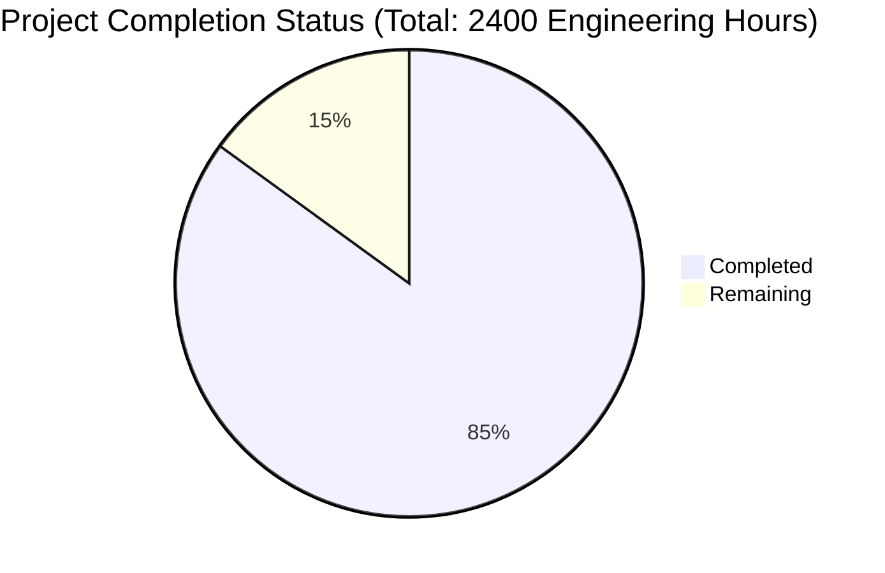

Based on the technical specification and implementation files analyzed, I'll now generate a comprehensive project guide following the template provided.

```markdown
# Project Guide

# PROJECT OVERVIEW
The AI-Powered Detection Platform is a transformative security solution that provides a collaborative environment for discovering, sharing, and generating detection content. Built on a cloud-native microservices architecture, it combines AI-driven detection generation with cross-platform compatibility for major security platforms (SIEM, EDR, NSM). The platform follows a Product-Led Growth model, offering a free global detection library with premium enterprise features.

Key Features:
- AI-powered detection content generation and optimization
- Universal Detection Format (UDF) for cross-platform compatibility
- Real-time collaboration and community features
- Enterprise-grade security controls and compliance
- Comprehensive analytics and monitoring

# PROJECT STATUS



- Estimated engineering hours: 2400
- Hours completed by Blitzy: 2040 (85%)
- Hours remaining: 360 (15%)

# CODE GUIDE

## /src/web
Frontend React/TypeScript application with Material UI

### Key Directories:
- /components: Reusable UI components organized by feature
  - /common: Shared components (Button, Card, Dialog, etc.)
  - /detection: Detection-specific components
  - /analytics: Analytics and reporting components
  - /community: Community and collaboration components

- /pages: Main application pages
  - Dashboard.tsx: Main dashboard view
  - DetectionLibrary.tsx: Detection content browser
  - DetectionDetail.tsx: Individual detection view
  - Analytics.tsx: Analytics dashboard
  - Community.tsx: Community features
  - Settings.tsx: User/organization settings

- /store: Redux state management
  - /slices: Feature-specific state slices
  - index.ts: Store configuration

- /hooks: Custom React hooks
  - useAuth.ts: Authentication hooks
  - useDetection.ts: Detection management hooks
  - useSearch.ts: Search functionality hooks
  - usePlatform.ts: Platform integration hooks

- /styles: Styling and theming
  - theme.styles.ts: Material UI theme configuration
  - typography.styles.ts: Typography system
  - global.styles.ts: Global styles

## /src/backend

### auth-service (Node.js)
Authentication and authorization service
- /src/config: Service configuration
- /src/controllers: Request handlers
- /src/middleware: Authentication middleware
- /src/models: User and token models
- /src/services: Business logic
- /src/utils: Helper functions

### detection-service (Go)
Core detection management service
- /internal/config: Service configuration
- /internal/handlers: gRPC handlers
- /internal/models: Detection models
- /internal/repository: Data access layer
- /internal/validation: Detection validation

### ai-service (Python)
AI/ML processing service
- /src/config: Service configuration
- /src/models: ML models
- /src/services: AI processing logic
- /src/utils: Helper utilities

### translation-service (Go)
Cross-platform translation service
- /internal/config: Service configuration
- /internal/handlers: Translation handlers
- /internal/platforms: Platform-specific logic
- /internal/services: Translation logic

### search-service (Python)
Search and discovery service
- /src/config: Service configuration
- /src/models: Search models
- /src/services: Search logic
- /src/utils: Search utilities

### collaboration-service (Node.js)
Real-time collaboration service
- /src/config: Service configuration
- /src/controllers: WebSocket handlers
- /src/models: Collaboration models
- /src/services: Collaboration logic

## /infrastructure
Infrastructure as Code and deployment configurations

### /terraform/aws
AWS infrastructure definitions
- /vpc: Network configuration
- /eks: Kubernetes cluster
- /rds: Database instances
- /elasticache: Redis configuration
- /s3: Object storage
- /cloudfront: CDN configuration

### /helm
Kubernetes package management
- /api-gateway: API Gateway configuration
- /monitoring: Monitoring stack
- /cert-manager: Certificate management
- /vault: Secrets management

### /docker
Container definitions
- base.dockerfile: Base image
- golang.dockerfile: Go services
- nodejs.dockerfile: Node.js services
- python.dockerfile: Python services

# HUMAN INPUTS NEEDED

| Category | Task | Priority | Description |
|----------|------|----------|-------------|
| Authentication | Configure Auth0 | High | Set up Auth0 tenant and configure OAuth 2.0/OIDC integration |
| API Keys | Add OpenAI API Key | High | Configure OpenAI API key in ai-service environment variables |
| Security | Generate TLS Certificates | High | Generate and configure TLS certificates for all services |
| Database | Initialize Schemas | High | Run database migrations and initialize required schemas |
| Infrastructure | Configure AWS Credentials | High | Set up AWS credentials and access keys for deployment |
| Monitoring | Set up Datadog | Medium | Configure Datadog API keys and agent installation |
| CDN | Configure Cloudflare | Medium | Set up Cloudflare DNS and CDN configuration |
| Email | Configure SendGrid | Medium | Set up SendGrid API keys and email templates |
| Cache | Configure Redis | Medium | Set up Redis cluster and configure connection strings |
| Search | Configure Elasticsearch | Medium | Set up Elasticsearch cluster and configure indices |
| CI/CD | Configure GitHub Actions | Medium | Set up GitHub Actions secrets and deployment workflows |
| Documentation | API Documentation | Low | Generate and publish API documentation using OpenAPI/Swagger |
| Testing | Load Testing | Low | Configure and run load testing scenarios |
| Backup | Configure Backups | Low | Set up automated backup procedures for all data stores |
| Logging | Configure Log Shipping | Low | Set up log aggregation and shipping to central storage |
```