# Technical Specifications

# 1. INTRODUCTION

## 1.1 EXECUTIVE SUMMARY

The AI-Powered Detection Platform represents a transformative solution for security teams, providing a collaborative environment for discovering, sharing, and generating detection content. Following a Product-Led Growth model similar to GitHub, the platform combines a free global detection library managed by AI with premium enterprise features. The system addresses the critical challenge of fragmented detection content across the security industry by creating a centralized, AI-driven ecosystem for security detection management.

This platform serves security analysts, engineers, and leaders while fostering a community of detection content contributors. By leveraging artificial intelligence for content generation, optimization, and cross-platform compatibility, the system aims to significantly reduce the time and expertise required to develop and maintain effective security detections.

## 1.2 SYSTEM OVERVIEW

### Project Context

| Aspect | Description |
|--------|-------------|
| Market Position | First-to-market AI-driven security detection platform with community focus |
| Target Market | Security teams across enterprise, mid-market, and SMB segments |
| Competitive Edge | AI-powered detection generation and cross-platform compatibility |
| Integration Landscape | Connects with major SIEM, EDR, NSM, SOAR, and TIP platforms |

### High-Level Description

The platform architecture consists of:

- Cloud-native microservices infrastructure
- AI/ML processing pipeline for detection generation
- Universal Detection Format (UDF) translation engine
- Real-time collaboration framework
- Enterprise-grade security controls
- Platform-specific deployment connectors

Core technical components include:

- Detection content management system
- AI model training and inference pipeline
- Cross-platform translation engine
- Community collaboration tools
- Analytics and monitoring system

### Success Criteria

| Metric Category | Target KPIs |
|----------------|-------------|
| User Adoption | - 100,000+ monthly active users<br>- 25% conversion to premium features |
| Content Growth | - 10,000+ public detections<br>- 1,000+ monthly contributions |
| Detection Quality | - 99% translation accuracy<br>- <5% false positive rate |
| Platform Performance | - 99.9% uptime<br>- <2s search response time |

## 1.3 SCOPE

### In-Scope Elements

Core Features:

| Feature Category | Components |
|-----------------|------------|
| Detection Management | - Global detection library<br>- Version control<br>- Quality validation<br>- Metadata management |
| AI Capabilities | - Natural language search<br>- Detection generation<br>- Cross-platform translation<br>- Performance optimization |
| Collaboration | - Public/private communities<br>- Discussion threads<br>- Change workflows<br>- Contribution tracking |
| Enterprise Features | - Private libraries<br>- Role-based access<br>- Usage analytics<br>- Custom workflows |

Implementation Boundaries:

- Support for major security platforms (SIEM, EDR, NSM)
- Global user base with multi-region deployment
- Enterprise and community user segments
- Detection content across all MITRE ATT&CK tactics

### Out-of-Scope Elements

- Mobile application development
- On-premises deployment options
- Custom hardware integration
- Incident response automation
- Threat intelligence generation
- Security tool configuration management
- User training and certification
- Professional services delivery

# 2. SYSTEM ARCHITECTURE

## 2.1 High-Level Architecture

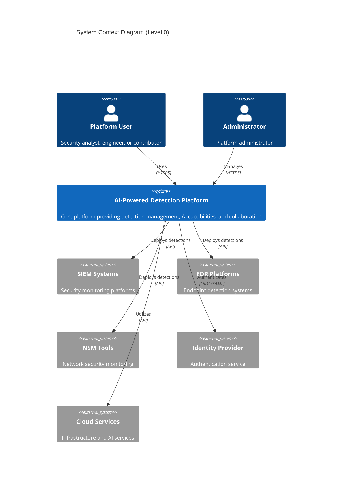

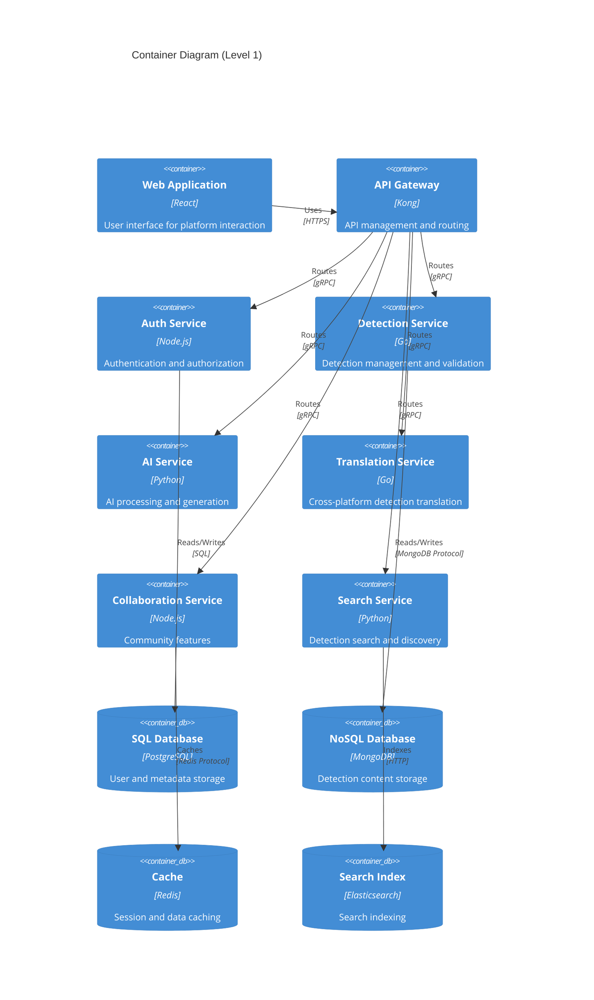

## 2.2 Component Details

### Core Services

| Component | Purpose | Technology Stack | Scaling Strategy |
|-----------|---------|-----------------|------------------|
| API Gateway | Request routing and rate limiting | Kong, Lua | Horizontal with load balancing |
| Auth Service | Identity and access management | Node.js, Passport | Horizontal with session affinity |
| Detection Service | Detection CRUD operations | Go, gRPC | Horizontal stateless |
| AI Service | ML model inference and training | Python, TensorFlow | Vertical with GPU support |
| Translation Service | Cross-platform conversion | Go, Protocol Buffers | Horizontal stateless |
| Collaboration Service | Real-time collaboration | Node.js, WebSocket | Horizontal with sticky sessions |
| Search Service | Content discovery | Python, Elasticsearch | Horizontal with sharding |

### Data Storage

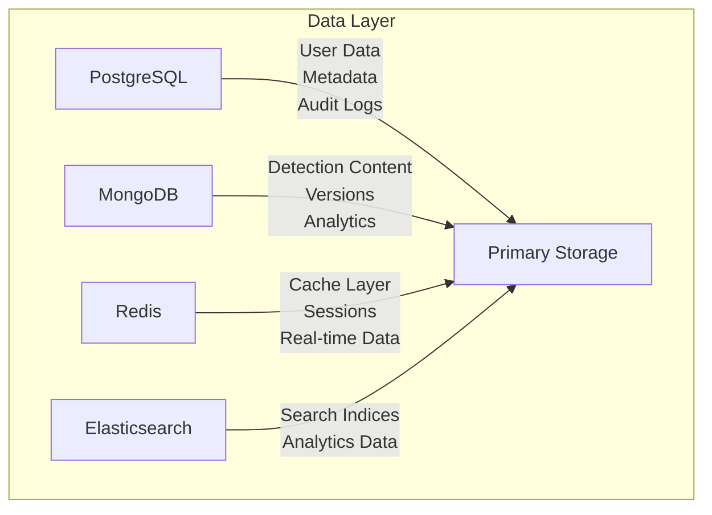

## 2.3 Technical Decisions

### Architecture Patterns

| Pattern | Implementation | Justification |
|---------|---------------|---------------|
| Microservices | Domain-driven service boundaries | Scalability and team autonomy |
| Event-driven | Apache Kafka message bus | Asynchronous processing and decoupling |
| CQRS | Separate read/write models | Performance optimization |
| API Gateway | Kong with custom plugins | Security and traffic management |
| Circuit Breaker | Resilience4j implementation | Fault tolerance |

### Communication Patterns

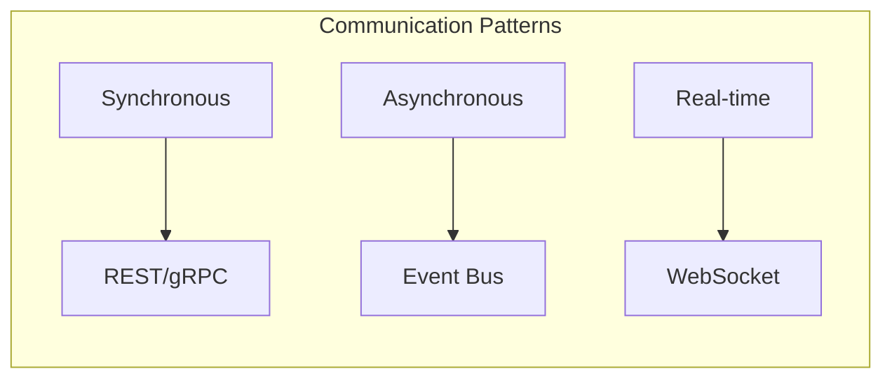

## 2.4 Cross-Cutting Concerns

### Observability Architecture

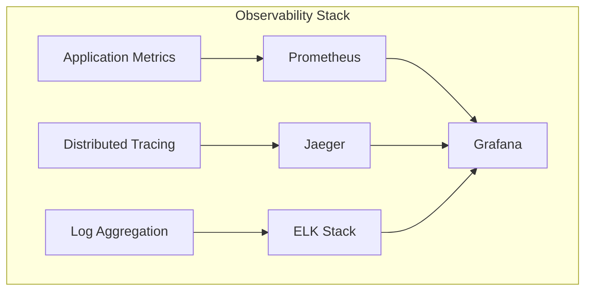

### Security Architecture

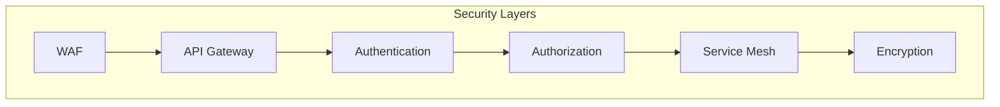

## 2.5 Deployment Architecture

```mermaid
C4Deployment
    title Deployment Diagram
    
    Deployment_Node(cdn, "CDN", "Cloudflare"){
        Container(static, "Static Assets", "Web content and assets")
    }
    
    Deployment_Node(k8s, "Kubernetes Cluster", "Production"){
        Deployment_Node(services, "Service Mesh", "Istio"){
            Container(api_pods, "API Services", "Multiple service pods")
            Container(worker_pods, "Worker Services", "Background processing pods")
        }
    }
    
    Deployment_Node(db, "Database Cluster", "Production"){
        Deployment_Node(primary, "Primary Zone", "US-EAST"){
            ContainerDb(db_primary, "Primary DB", "PostgreSQL/MongoDB")
        }
        Deployment_Node(replica, "Replica Zone", "US-WEST"){
            ContainerDb(db_replica, "Replica DB", "Read replicas")
        }
    }
    
    Rel(cdn, k8s, "Routes requests", "HTTPS")
    Rel(k8s, db, "Persists data", "TLS")
    Rel(primary, replica, "Replicates", "Internal")
```

# 3. SYSTEM COMPONENTS ARCHITECTURE

## 3.1 USER INTERFACE DESIGN

### 3.1.1 Design System Specifications

| Component | Specification | Implementation |
|-----------|--------------|----------------|
| Typography | - Primary: Inter<br>- Secondary: Roboto Mono<br>- Scale: 12/14/16/20/24/32px | Material Design type system |
| Color Palette | - Primary: #1976D2<br>- Secondary: #424242<br>- Error: #D32F2F<br>- Success: #388E3C | Support dark/light modes |
| Spacing | 8px base unit with 4/8/16/24/32/48px scale | Consistent component spacing |
| Breakpoints | - Mobile: 360px<br>- Tablet: 768px<br>- Desktop: 1024px<br>- Wide: 1440px | Responsive layout grid |
| Elevation | 8 levels of elevation with consistent shadows | Material elevation system |

### 3.1.2 Layout Structure

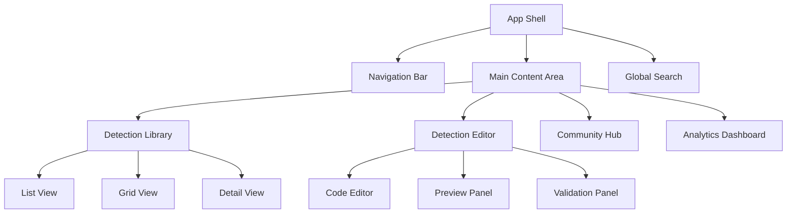

### 3.1.3 Critical User Flows

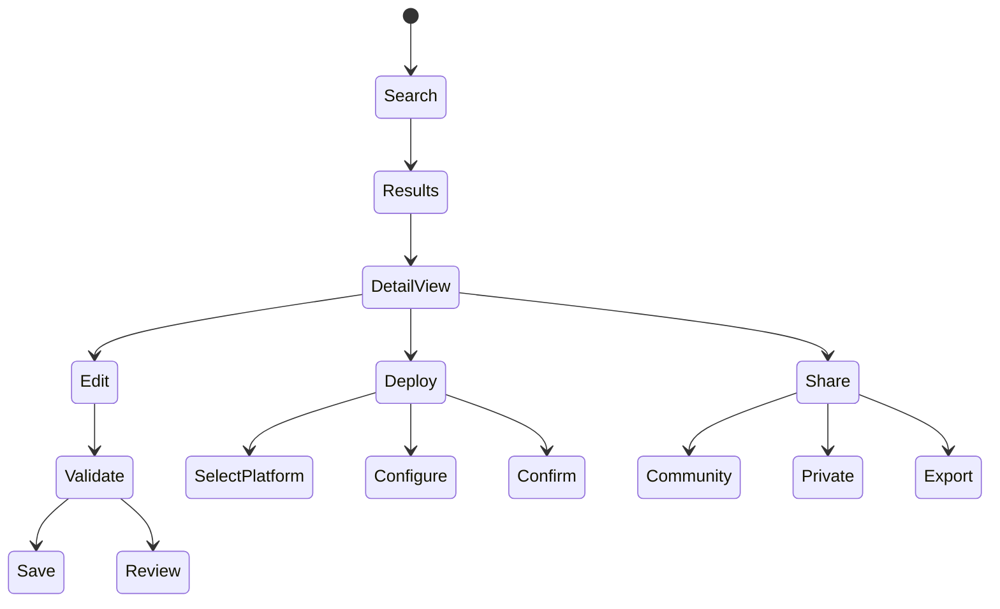

## 3.2 DATABASE DESIGN

### 3.2.1 Data Models

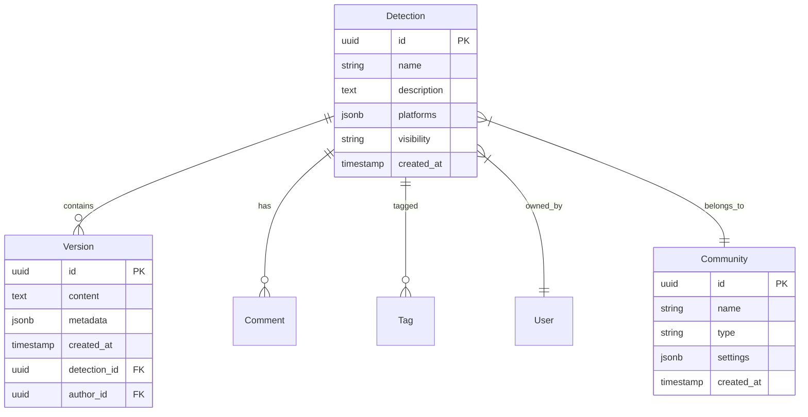

### 3.2.2 Storage Architecture

| Store Type | Technology | Purpose | Scaling Strategy |
|------------|------------|---------|------------------|
| Primary DB | PostgreSQL | Relational data | Horizontal sharding |
| Document Store | MongoDB | Detection content | Replica sets |
| Cache | Redis | Session/search cache | Cluster mode |
| Search Index | Elasticsearch | Full-text search | Cross-region clusters |
| File Storage | S3 | Binary attachments | CDN distribution |

### 3.2.3 Data Partitioning

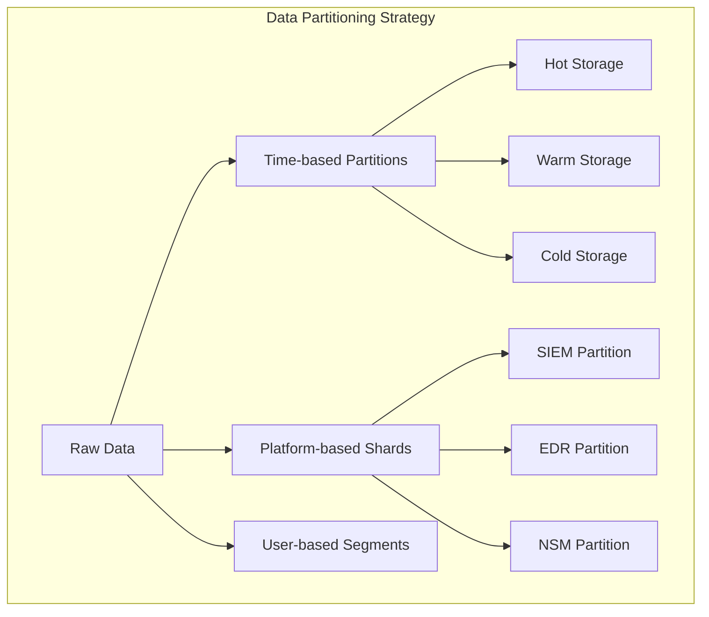

## 3.3 API DESIGN

### 3.3.1 API Architecture

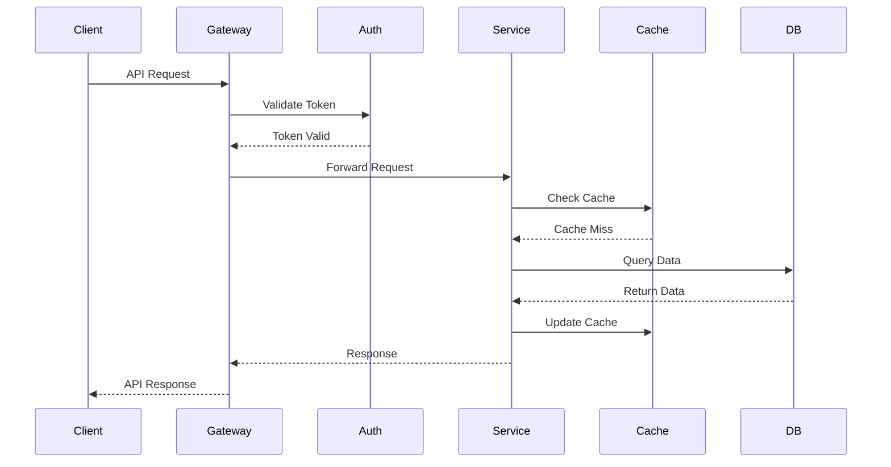

### 3.3.2 API Specifications

| Endpoint Category | Authentication | Rate Limit | Cache TTL |
|------------------|----------------|------------|-----------|
| Public Search | API Key | 1000/hour | 5 minutes |
| Detection CRUD | JWT | 500/hour | No cache |
| Platform Deploy | OAuth 2.0 | 100/hour | No cache |
| Analytics | JWT | 200/hour | 15 minutes |
| Community | JWT | 300/hour | 10 minutes |

### 3.3.3 Integration Patterns

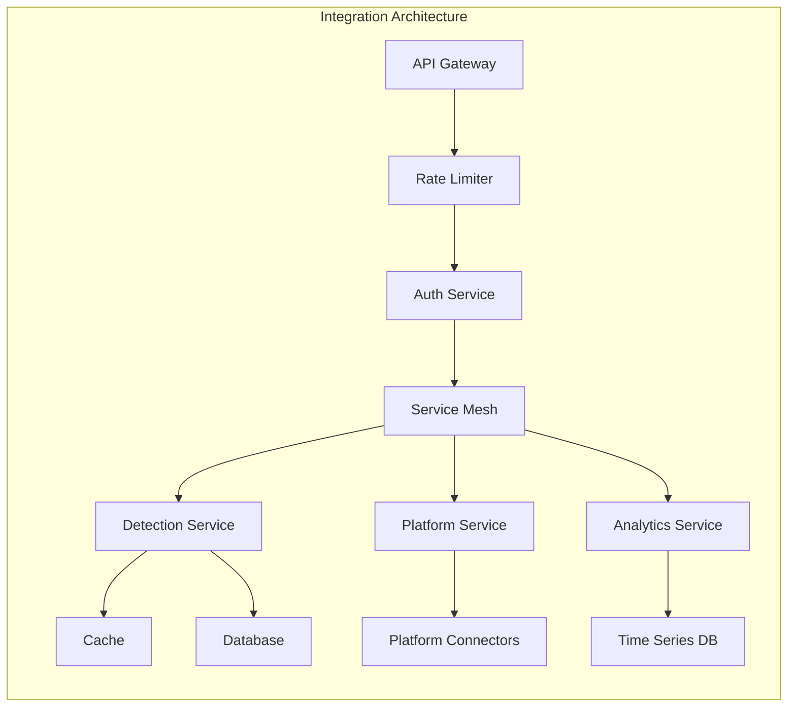

# 4. TECHNOLOGY STACK

## 4.1 PROGRAMMING LANGUAGES

| Component | Language | Version | Justification |
|-----------|----------|---------|---------------|
| API Services | Go | 1.21+ | High performance, strong typing, excellent concurrency |
| AI/ML Services | Python | 3.11+ | Rich ML ecosystem, LangChain compatibility |
| Frontend | TypeScript | 5.0+ | Type safety, enhanced developer experience |
| Real-time Services | Node.js | 20 LTS | Event-driven architecture, WebSocket support |
| Infrastructure | HCL | 2.0+ | Terraform native, infrastructure as code |

## 4.2 FRAMEWORKS & LIBRARIES

### Backend Frameworks

| Framework | Version | Purpose | Justification |
|-----------|---------|---------|---------------|
| Gin | 1.9+ | Go HTTP framework | High performance, middleware support |
| FastAPI | 0.104+ | Python API framework | AsyncIO support, automatic OpenAPI |
| Express | 4.18+ | Node.js web framework | WebSocket handling, middleware ecosystem |
| LangChain | 0.0.335+ | AI/ML orchestration | Large language model integration |
| gRPC | 1.59+ | Service communication | Efficient binary protocol, type safety |

### Frontend Frameworks

| Framework | Version | Purpose | Justification |
|-----------|---------|---------|---------------|
| React | 18.2+ | UI framework | Component reusability, virtual DOM |
| Material UI | 5.14+ | Component library | Design system compliance |
| Redux Toolkit | 1.9+ | State management | Predictable state updates |
| React Query | 4.0+ | Data fetching | Cache management, real-time updates |
| Monaco Editor | 0.44+ | Code editor | Detection rule editing support |

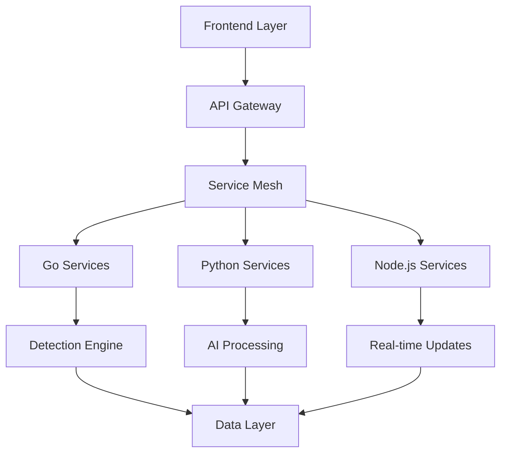

## 4.3 DATABASES & STORAGE

| Type | Technology | Version | Purpose |
|------|------------|---------|---------|
| Primary Database | PostgreSQL | 15+ | Relational data, ACID compliance |
| Document Store | MongoDB | 7.0+ | Detection content, flexible schema |
| Search Engine | Elasticsearch | 8.11+ | Full-text search, analytics |
| Cache Layer | Redis | 7.2+ | Session management, real-time data |
| Object Storage | S3 | - | Binary attachments, backups |
| Time Series | TimescaleDB | 2.11+ | Performance metrics, monitoring |

### Data Flow Architecture

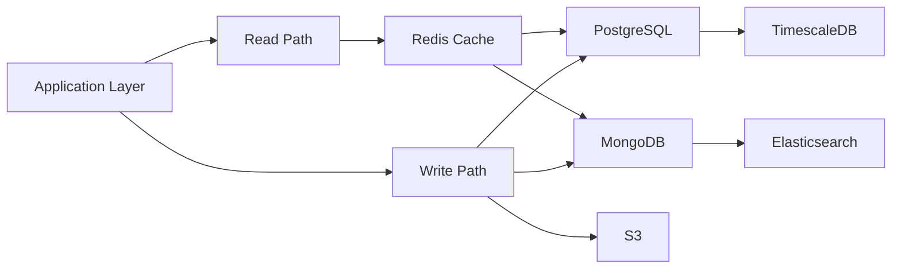

## 4.4 THIRD-PARTY SERVICES

| Category | Service | Purpose | Integration Method |
|----------|---------|---------|-------------------|
| Authentication | Auth0 | Identity management | OAuth 2.0/OIDC |
| CDN | Cloudflare | Content delivery, DDoS protection | DNS/API |
| Monitoring | Datadog | Observability, APM | Agent/API |
| AI Platform | OpenAI | Large language models | REST API |
| Email | SendGrid | Transactional email | SMTP/API |
| Analytics | Snowflake | Data warehouse | SDK/API |

## 4.5 DEVELOPMENT & DEPLOYMENT

### Development Tools

| Tool | Version | Purpose |
|------|---------|---------|
| Docker | 24+ | Containerization |
| Kubernetes | 1.28+ | Container orchestration |
| Terraform | 1.6+ | Infrastructure as code |
| ArgoCD | 2.8+ | GitOps deployment |
| Helm | 3.13+ | Package management |

### CI/CD Pipeline

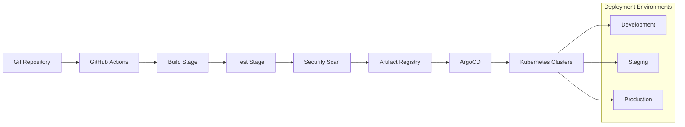

### Infrastructure Requirements

| Component | Specification | Scaling Strategy |
|-----------|--------------|------------------|
| API Servers | t3.xlarge | Horizontal auto-scaling |
| AI Workers | g4dn.xlarge | GPU-enabled instances |
| Databases | db.r6g.xlarge | Read replicas, sharding |
| Cache Nodes | cache.r6g.large | Cluster mode enabled |
| Search Cluster | c6g.2xlarge | Cross-zone deployment |

# 5. SYSTEM DESIGN

## 5.1 USER INTERFACE DESIGN

### 5.1.1 Layout Structure

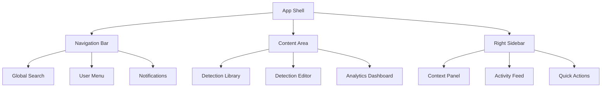

### 5.1.2 Key Components

| Component | Description | Interactions |
|-----------|-------------|--------------|
| Global Search | Natural language search with auto-complete | - Real-time suggestions<br>- Filter controls<br>- Recent searches |
| Detection Editor | Split-pane code editor with preview | - Syntax highlighting<br>- Live validation<br>- Platform preview |
| Analytics Dashboard | Customizable metrics display | - Drag-drop widgets<br>- Date range selection<br>- Export options |
| Context Panel | Context-aware information sidebar | - Related content<br>- Quick actions<br>- Documentation |

### 5.1.3 Responsive Breakpoints

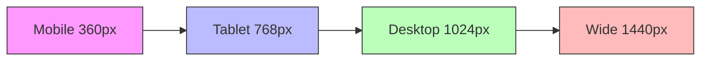

## 5.2 DATABASE DESIGN

### 5.2.1 Schema Design

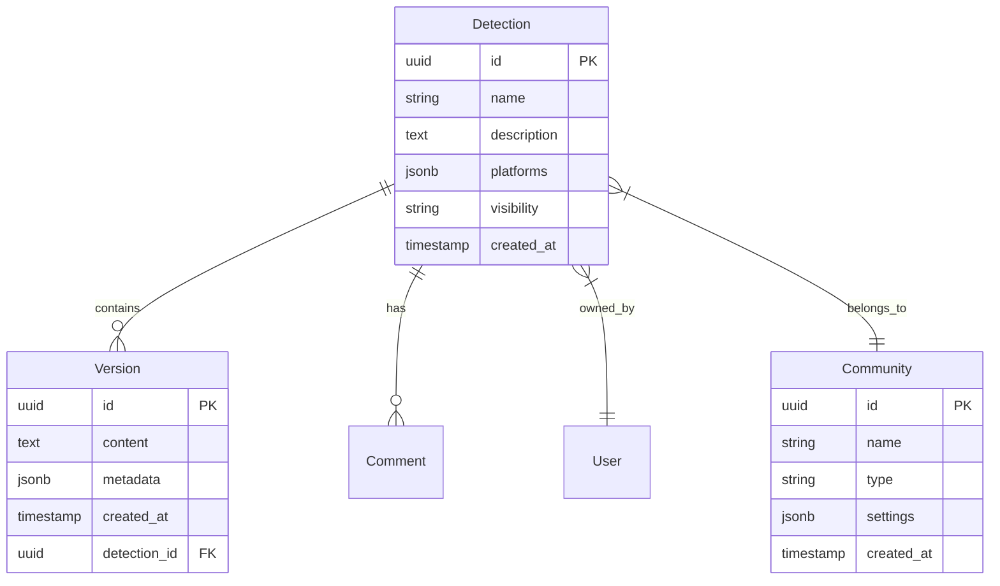

### 5.2.2 Storage Architecture

| Store Type | Technology | Purpose | Scaling Strategy |
|------------|------------|---------|------------------|
| Primary DB | PostgreSQL 15+ | Relational data | Horizontal sharding |
| Document Store | MongoDB 7.0+ | Detection content | Replica sets |
| Search Index | Elasticsearch 8.11+ | Full-text search | Cross-region clusters |
| Cache Layer | Redis 7.2+ | Session/search cache | Cluster mode |

### 5.2.3 Data Partitioning

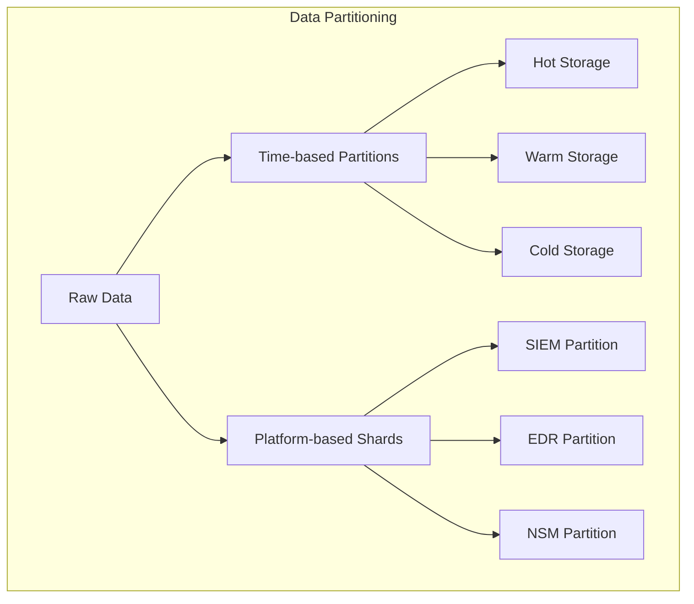

## 5.3 API DESIGN

### 5.3.1 API Architecture

```mermaid
sequenceDiagram
    participant Client
    participant Gateway
    participant Auth
    participant Service
    participant Cache
    participant DB
    
    Client->>Gateway: API Request
    Gateway->>Auth: Validate Token
    Auth-->>Gateway: Token Valid
    Gateway->>Service: Forward Request
    Service->>Cache: Check Cache
    Cache-->>Service: Cache Miss
    Service->>DB: Query Data
    DB-->>Service: Return Data
    Service->>Cache: Update Cache
    Service-->>Gateway: Response
    Gateway-->>Client: API Response
```

### 5.3.2 API Endpoints

| Category | Endpoint | Method | Purpose |
|----------|----------|--------|---------|
| Detection | /api/v1/detections | GET, POST | Detection management |
| Platform | /api/v1/platforms | GET | Platform integration |
| Community | /api/v1/communities | GET, POST | Community features |
| Analytics | /api/v1/analytics | GET | Usage metrics |

### 5.3.3 Integration Patterns

```mermaid
graph LR
    subgraph "Integration Architecture"
        A[API Gateway] --> B[Rate Limiter]
        B --> C[Auth Service]
        C --> D[Service Mesh]
        
        D --> E[Detection Service]
        D --> F[Platform Service]
        D --> G[Analytics Service]
        
        E --> H[Cache]
        E --> I[Database]
        
        F --> J[Platform Connectors]
        G --> K[Time Series DB]
    end
```

### 5.3.4 API Security

| Security Layer | Implementation | Purpose |
|----------------|----------------|---------|
| Authentication | JWT/OAuth 2.0 | Identity verification |
| Authorization | RBAC | Access control |
| Rate Limiting | Token bucket | Resource protection |
| Encryption | TLS 1.3 | Data protection |
| Validation | JSON Schema | Input sanitization |

# 6. USER INTERFACE DESIGN

## 6.1 Design System

| Component | Specification | Implementation |
|-----------|--------------|----------------|
| Typography | Primary: Inter<br>Secondary: Roboto Mono | Material Design type system |
| Colors | Primary: #1976D2<br>Secondary: #424242<br>Error: #D32F2F<br>Success: #388E3C | Support dark/light modes |
| Spacing | Base unit: 8px<br>Scale: 4/8/16/24/32/48px | Consistent grid system |
| Breakpoints | Mobile: 360px<br>Tablet: 768px<br>Desktop: 1024px<br>Wide: 1440px | Responsive layout |

## 6.2 Core Layouts

### 6.2.1 Main Dashboard
```
+----------------------------------------------------------+
|[#] AI Detection Platform                [@] Admin    [=]   |
+----------------------------------------------------------+
|                                                           |
| +----------------+ +----------------+ +----------------+   |
| |[*] Featured    | |[!] Recent     | |[i] Statistics  |   |
| |Detections      | |Activity       | |                |   |
| |                | |               | | Active: 1.2k    |   |
| |[View All]      | |[View All]     | | New: +121      |   |
| +----------------+ +----------------+ +----------------+   |
|                                                           |
| +--------------------------------------------------+     |
| | Global Detection Library                    [+]   |     |
| |                                                  |     |
| | [Search Detections...]                          |     |
| |                                                  |     |
| | [ ] SIEM  [ ] EDR  [ ] NSM  [v] Sort by: Latest |     |
| +--------------------------------------------------+     |
|                                                           |
| Detection List:                                           |
| +--------------------------------------------------+     |
| | > Ransomware Detection v2.1        [*]   [$]     |     |
| | Updated: 2h ago | Accuracy: 98% | Downloads: 1.2k |     |
| +--------------------------------------------------+     |
| | > Lateral Movement Detection       [*]            |     |
| | Updated: 1d ago | Accuracy: 95% | Downloads: 890  |     |
| +--------------------------------------------------+     |
+----------------------------------------------------------+
```

### 6.2.2 Detection Editor
```
+----------------------------------------------------------+
| Detection Editor - Ransomware Detection v2.1     [?] [x]  |
+----------------------------------------------------------+
| [Save] [Validate] [Deploy]                    Status: OK   |
+----------------------------------------------------------+
|                          |                                 |
| Detection Content        | Live Preview                    |
| +--------------------+  | +-------------------------+     |
| |                    |  | | Platform: [v] SIEM      |     |
| | rule RansomwareV2 {|  | |                         |     |
| |   meta:           |  | | Validation Results:      |     |
| |     author: "@jd" |  | | [====] 100% Valid       |     |
| |     version: "2.1"|  | |                         |     |
| |   strings:        |  | | Performance Impact: Low  |     |
| |     $s1 = "enc"   |  | | Coverage: High          |     |
| |   condition:      |  | |                         |     |
| |     $s1          }|  | | [Deploy to Platform]    |     |
| +--------------------+  | +-------------------------+     |
|                        |                                 |
+----------------------------------------------------------+
| [<] Previous Version   Platform Support   [>] Next Version |
+----------------------------------------------------------+
```

### 6.2.3 Community Hub
```
+----------------------------------------------------------+
| Community Hub                              [@] Profile     |
+----------------------------------------------------------+
| +----------------+ +-----------------------------------+   |
| | Communities    | | Active Discussions                |   |
| |                | |                                   |   |
| | [+] Create New | | > Improving EDR Detection Rate    |   |
| |                | | [!] 23 new replies | 2h ago      |   |
| | > Public       | |                                   |   |
| | > Enterprise   | | > Best Practices for SIEM Rules   |   |
| | > Research     | | 12 replies | 1d ago              |   |
| |                | |                                   |   |
| | [View All]     | | [Load More]                      |   |
| +----------------+ +-----------------------------------+   |
|                                                           |
| Top Contributors:                                         |
| +--------------------------------------------------+     |
| | [@] John D.    [*] 234 detections | 98% accuracy  |     |
| | [@] Sarah M.   [*] 189 detections | 96% accuracy  |     |
| +--------------------------------------------------+     |
+----------------------------------------------------------+
```

## 6.3 Component Key

### Navigation & Actions
- [#] Main menu/dashboard
- [@] User profile/avatar
- [=] Settings menu
- [?] Help/documentation
- [x] Close/cancel
- [+] Create/add new
- [<] [>] Navigation arrows
- [*] Favorite/important
- [!] Alert/notification
- [$] Premium/paid content

### Input Elements
- [...] Text input field
- [ ] Checkbox
- ( ) Radio button
- [v] Dropdown menu
- [Button] Action button
- [====] Progress indicator

### Layout Elements
- +--+ Border/container
- |  | Vertical separator
- +-- Tree/hierarchy indicator

## 6.4 Interaction Patterns

| Pattern | Implementation | Usage |
|---------|---------------|-------|
| Search | Real-time suggestions with highlighting | Global detection search |
| Filtering | Multi-select faceted filters | Detection library browsing |
| Sorting | Dropdown with common sort options | List organization |
| Pagination | Infinite scroll with load more | Content lists |
| Validation | Real-time with visual feedback | Detection editor |
| Navigation | Breadcrumbs and section tabs | Cross-platform movement |

## 6.5 Responsive Behavior

| Breakpoint | Layout Changes | Component Adjustments |
|------------|---------------|---------------------|
| Mobile (<768px) | Single column, stacked cards | Collapsed menu, full-width inputs |
| Tablet (768-1024px) | Two columns, side panel | Expandable sections, compact cards |
| Desktop (>1024px) | Three columns, fixed sidebar | Full feature set, expanded views |

# 7. SECURITY CONSIDERATIONS

## 7.1 AUTHENTICATION AND AUTHORIZATION

### Authentication Methods

| Method | Implementation | Use Case | Security Level |
|--------|---------------|-----------|----------------|
| OAuth 2.0/OIDC | Auth0 integration | SSO and social login | High |
| JWT | Custom tokens with RSA-256 | API authentication | High |
| MFA | TOTP and hardware security keys | High-risk operations | Very High |
| API Keys | Encrypted keys with rotation | Platform integrations | High |

### Authorization Model

```mermaid
graph TD
    A[User Request] --> B{Authentication}
    B -->|Success| C{Role Check}
    B -->|Failure| D[Access Denied]
    
    C -->|Has Permission| E[Access Granted]
    C -->|No Permission| D
    
    E --> F{Resource Access}
    F -->|Public| G[Direct Access]
    F -->|Private| H{Ownership Check}
    
    H -->|Owner| I[Full Access]
    H -->|Team Member| J[Limited Access]
    H -->|Other| D
```

### RBAC Structure

| Role | Permissions | Access Level |
|------|------------|--------------|
| Admin | Full system access | Global |
| Organization Admin | Org-wide management | Organization |
| Team Lead | Team management, private libraries | Team |
| Contributor | Content creation, editing | Individual |
| Reader | View and use content | Read-only |

## 7.2 DATA SECURITY

### Encryption Standards

| Data State | Method | Key Management | Rotation |
|------------|--------|----------------|-----------|
| In Transit | TLS 1.3 | Managed certificates | 90 days |
| At Rest | AES-256-GCM | KMS integration | 180 days |
| Field Level | AES-256-CBC | Application keys | 90 days |
| Backups | AES-256-CBC | Offline master key | Annual |

### Data Classification

```mermaid
graph TD
    subgraph "Data Classification Levels"
        A[Public] --> B[Internal]
        B --> C[Confidential]
        C --> D[Restricted]
    end
    
    subgraph "Security Controls"
        E[Basic Encryption]
        F[Access Logging]
        G[Field Encryption]
        H[MFA Required]
    end
    
    A --> E
    B --> F
    C --> G
    D --> H
```

## 7.3 SECURITY PROTOCOLS

### Security Architecture

```mermaid
graph LR
    subgraph "Security Layers"
        A[WAF/CDN] --> B[Load Balancer]
        B --> C[API Gateway]
        C --> D[Service Mesh]
        D --> E[Application]
        E --> F[Database]
    end
    
    subgraph "Security Controls"
        G[DDoS Protection]
        H[Rate Limiting]
        I[Authentication]
        J[Authorization]
        K[Encryption]
    end
    
    A --- G
    C --- H & I
    D --- J
    F --- K
```

### Security Monitoring

| Component | Monitoring Type | Alert Threshold | Response Time |
|-----------|----------------|-----------------|---------------|
| WAF | Attack patterns | 100 requests/min | Immediate |
| API Gateway | Rate limiting | 1000 requests/min | < 1 minute |
| Authentication | Failed attempts | 5 failures/minute | < 5 minutes |
| Data Access | Suspicious patterns | Anomaly detection | < 15 minutes |
| Infrastructure | Vulnerability scanning | Critical findings | < 1 hour |

### Security Compliance

| Standard | Requirements | Validation Frequency |
|----------|--------------|---------------------|
| SOC 2 Type II | Access controls, encryption, monitoring | Annual audit |
| GDPR | Data privacy, consent management | Continuous |
| PCI DSS | Payment data security | Quarterly scan |
| ISO 27001 | Information security management | Annual review |

### Incident Response

```mermaid
stateDiagram-v2
    [*] --> Detection
    Detection --> Analysis
    Analysis --> Containment
    Containment --> Eradication
    Eradication --> Recovery
    Recovery --> PostMortem
    PostMortem --> [*]
    
    Analysis --> Escalation
    Escalation --> Containment
```

### Security Testing

| Test Type | Frequency | Coverage | Tools |
|-----------|-----------|----------|-------|
| Penetration Testing | Quarterly | External/Internal | Burp Suite, Metasploit |
| Vulnerability Scanning | Weekly | Infrastructure | Nessus, Qualys |
| SAST | Every commit | Application code | SonarQube, Checkmarx |
| DAST | Daily | Production endpoints | OWASP ZAP |
| Container Scanning | Every build | Container images | Trivy, Clair |

# 8. INFRASTRUCTURE

## 8.1 DEPLOYMENT ENVIRONMENT

The AI-Powered Detection Platform utilizes a cloud-native deployment model with multi-region availability.

| Environment | Purpose | Configuration |
|-------------|---------|---------------|
| Production | Live service delivery | Multi-region, high availability |
| Staging | Pre-production validation | Single region, production parity |
| Development | Feature development | Single region, reduced capacity |
| DR | Disaster recovery | Cross-region failover |

```mermaid
graph TB
    subgraph "Global Infrastructure"
        A[Primary Region US-EAST] --> B[DR Region US-WEST]
        A --> C[EU Region]
        A --> D[APAC Region]
        
        subgraph "Regional Components"
            E[Load Balancer]
            F[Kubernetes Cluster]
            G[Database Cluster]
            H[Cache Cluster]
        end
    end
```

## 8.2 CLOUD SERVICES

Primary cloud provider: AWS with multi-cloud capabilities for specific services.

| Service | Provider | Purpose | Justification |
|---------|----------|---------|---------------|
| EKS | AWS | Kubernetes management | Native K8s integration, mature tooling |
| RDS | AWS | Database hosting | Managed PostgreSQL, automated failover |
| DocumentDB | AWS | MongoDB hosting | MongoDB compatibility, managed service |
| ElastiCache | AWS | Redis caching | Managed Redis, cluster mode |
| OpenAI API | Azure | AI model inference | Leading LLM capabilities |
| CloudFront | AWS | CDN | Global edge network, low latency |
| S3 | AWS | Object storage | Durability, global replication |

## 8.3 CONTAINERIZATION

Docker-based containerization strategy for all application services.

```mermaid
graph TD
    subgraph "Container Architecture"
        A[Base Images] --> B[Service Images]
        B --> C[Development Images]
        B --> D[Production Images]
        
        E[Image Registry] --> F[ECR]
        E --> G[Container Security]
        
        H[Build Process] --> I[Multi-stage Builds]
        H --> J[Layer Optimization]
    end
```

| Image Type | Base Image | Size Limit | Security Scanning |
|------------|------------|------------|-------------------|
| Frontend | node:20-alpine | 250MB | Trivy, Snyk |
| API Services | golang:1.21-alpine | 150MB | Trivy, Snyk |
| AI Services | python:3.11-slim | 500MB | Trivy, Snyk |
| Utils | alpine:3.18 | 100MB | Trivy, Snyk |

## 8.4 ORCHESTRATION

Kubernetes-based orchestration using AWS EKS with the following configuration:

```mermaid
graph TB
    subgraph "Kubernetes Architecture"
        A[Ingress Controller] --> B[Service Mesh]
        B --> C[Application Pods]
        B --> D[Background Workers]
        
        E[Cluster Autoscaler] --> F[Node Groups]
        G[Secrets Management] --> H[Vault Integration]
        
        I[Monitoring] --> J[Prometheus]
        I --> K[Grafana]
    end
```

| Component | Implementation | Purpose |
|-----------|---------------|----------|
| Service Mesh | Istio | Traffic management, security |
| Ingress | NGINX Ingress | Load balancing, routing |
| Autoscaling | Cluster Autoscaler | Resource optimization |
| Secrets | HashiCorp Vault | Secrets management |
| Monitoring | Prometheus/Grafana | Metrics and visualization |

## 8.5 CI/CD PIPELINE

Automated deployment pipeline using GitHub Actions and ArgoCD.

```mermaid
graph LR
    A[GitHub] --> B[GitHub Actions]
    B --> C[Build & Test]
    C --> D[Security Scan]
    D --> E[Image Build]
    E --> F[Image Registry]
    F --> G[ArgoCD]
    G --> H[Kubernetes Clusters]
    
    subgraph "Deployment Environments"
        I[Development]
        J[Staging]
        K[Production]
    end
    
    H --> I
    H --> J
    H --> K
```

| Stage | Tools | SLA | Automation |
|-------|-------|-----|------------|
| Code Analysis | SonarQube, ESLint | < 10 min | Full |
| Unit Tests | Jest, Go Test | < 15 min | Full |
| Security Scan | Snyk, Trivy | < 20 min | Full |
| Integration Tests | Cypress, Postman | < 30 min | Full |
| Deployment | ArgoCD | < 15 min | Semi-automated |

# APPENDICES

## A.1 ADDITIONAL TECHNICAL INFORMATION

### A.1.1 Detection Format Mappings

```mermaid
graph TD
    A[Universal Detection Format] --> B[SIEM]
    A --> C[EDR]
    A --> D[NSM]
    
    B --> E[Splunk]
    B --> F[QRadar]
    B --> G[Elastic]
    
    C --> H[CrowdStrike]
    C --> I[SentinelOne]
    C --> J[Microsoft Defender]
    
    D --> K[Zeek]
    D --> L[Suricata]
    D --> M[Snort]
```

### A.1.2 AI Model Architecture

| Component | Technology | Purpose | Performance Metrics |
|-----------|------------|---------|-------------------|
| Base Model | GPT-4 | Natural language understanding | Latency < 500ms |
| Detection Head | Custom Transformer | Detection generation | Accuracy > 95% |
| Translation Layer | BERT-based | Cross-platform conversion | Fidelity > 98% |
| Optimization Engine | Reinforcement Learning | Performance tuning | Improvement > 25% |

### A.1.3 Platform Integration Matrix

| Platform Type | API Version | Authentication | Rate Limits | Sync Method |
|--------------|-------------|----------------|-------------|-------------|
| Splunk | 8.x+ | OAuth 2.0 | 1000/hour | Push/Pull |
| QRadar | 7.x+ | Token | 500/hour | Push |
| CrowdStrike | 6.x+ | OAuth 2.0 | 750/hour | Push/Pull |
| SentinelOne | 4.x+ | API Key | 600/hour | Push |
| Microsoft Defender | 2.x+ | OAuth 2.0 | 800/hour | Push/Pull |

## A.2 GLOSSARY

| Term | Definition |
|------|------------|
| Detection Content | Security rules, signatures, or logic used to identify potential security threats |
| False Positive | An alert triggered by normal activity incorrectly identified as malicious |
| Platform Connector | Integration component enabling direct communication with security platforms |
| Quality Score | Numerical rating based on detection accuracy, performance, and community validation |
| Universal Detection Format | Standardized format for cross-platform detection content exchange |
| Detection Library | Organized collection of security detection content with metadata |
| Community Validation | Peer review process for detection content quality assurance |
| Detection Translation | Process of converting detection logic between different platform formats |
| Platform Optimization | Tuning detection content for specific platform performance requirements |
| Detection Deployment | Process of implementing detection content in target security platforms |

## A.3 ACRONYMS

| Acronym | Full Form |
|---------|-----------|
| API | Application Programming Interface |
| ATT&CK | Adversarial Tactics, Techniques & Common Knowledge |
| BERT | Bidirectional Encoder Representations from Transformers |
| CDN | Content Delivery Network |
| CRUD | Create, Read, Update, Delete |
| EDR | Endpoint Detection and Response |
| GPT | Generative Pre-trained Transformer |
| IOPS | Input/Output Operations Per Second |
| JWT | JSON Web Token |
| KSQL | Kafka Structured Query Language |
| LLM | Large Language Model |
| MFA | Multi-Factor Authentication |
| NSM | Network Security Monitoring |
| OIDC | OpenID Connect |
| RBAC | Role-Based Access Control |
| REST | Representational State Transfer |
| SIEM | Security Information and Event Management |
| SOAR | Security Orchestration and Response |
| SSO | Single Sign-On |
| TIP | Threat Intelligence Platform |
| UDF | Universal Detection Format |
| WAF | Web Application Firewall |
| YARA | Yet Another Recursive Acronym |
| YAML | YAML Ain't Markup Language |