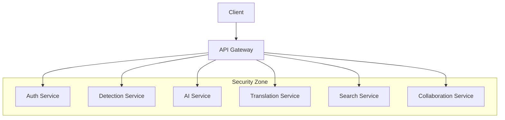

# AI-Powered Detection Platform - Backend Services

[](LICENSE)
[](https://www.docker.com/)
[](https://nodejs.org/)
[](https://golang.org/)
[](https://www.python.org/)

<!-- markdown-toc@1.2.0 start -->
## Table of Contents

* [Introduction](#introduction)
  * [Overview](#overview)
  * [Technology Stack](#technology-stack)
  * [Key Features](#key-features)
  * [System Requirements](#system-requirements)
  * [Version Compatibility](#version-compatibility)
* [Prerequisites](#prerequisites)
  * [Required Software](#required-software)
  * [Development Tools](#development-tools)
  * [Security Requirements](#security-requirements)
* [Getting Started](#getting-started)
  * [Repository Structure](#repository-structure)
  * [Environment Setup](#environment-setup)
  * [Service Initialization](#service-initialization)
  * [Development Workflow](#development-workflow)
  * [Debugging Guide](#debugging-guide)
* [Services Architecture](#services-architecture)
  * [API Gateway](#api-gateway)
  * [Authentication Service](#authentication-service)
  * [Detection Service](#detection-service)
  * [AI Service](#ai-service)
  * [Translation Service](#translation-service)
  * [Search Service](#search-service)
  * [Collaboration Service](#collaboration-service)
* [Development Guidelines](#development-guidelines)
  * [Code Style](#code-style)
  * [Testing Strategy](#testing-strategy)
  * [API Documentation](#api-documentation)
  * [Performance Optimization](#performance-optimization)
  * [Security Best Practices](#security-best-practices)
* [Deployment](#deployment)
  * [Environment Configuration](#environment-configuration)
  * [Container Registry](#container-registry)
  * [Kubernetes Deployment](#kubernetes-deployment)
  * [Monitoring Setup](#monitoring-setup)
  * [Scaling Strategy](#scaling-strategy)
  * [Backup & Recovery](#backup--recovery)
* [Security Implementation](#security-implementation)
  * [Authentication](#authentication)
  * [Authorization](#authorization)
  * [Data Protection](#data-protection)
  * [API Security](#api-security)
  * [Infrastructure Security](#infrastructure-security)
  * [Compliance](#compliance)
* [Troubleshooting](#troubleshooting)
  * [Common Issues](#common-issues)
  * [Debugging Procedures](#debugging-procedures)
  * [Logging](#logging)
  * [Error Handling](#error-handling)
<!-- markdown-toc end -->

## Introduction

### Overview
The AI-Powered Detection Platform is a cloud-native microservices architecture designed to provide enterprise-grade security detection management, AI-driven content generation, and cross-platform compatibility.

### Technology Stack
- **API Gateway**: Kong 3.4
- **Authentication**: Node.js 20 LTS
- **Core Services**: Go 1.21+
- **AI Processing**: Python 3.11+
- **Databases**: PostgreSQL 15+, MongoDB 7.0+
- **Cache**: Redis 7.2+
- **Search**: Elasticsearch 8.11+

### Key Features
- Microservices-based architecture with service mesh
- Real-time detection content management
- AI-powered detection generation and optimization
- Cross-platform detection translation
- Enterprise-grade security controls
- Scalable and resilient infrastructure

### System Requirements
- Docker Engine 24+
- Docker Compose 2.21+
- Kubernetes 1.28+ (production)
- 16GB RAM (minimum)
- 4 CPU cores (minimum)
- 100GB storage (minimum)

### Version Compatibility
| Component | Version | Notes |
|-----------|---------|-------|
| Docker | 24+ | Required for containerization |
| Node.js | 20 LTS | Authentication service |
| Go | 1.21+ | Core services |
| Python | 3.11+ | AI services |
| PostgreSQL | 15+ | Primary database |
| MongoDB | 7.0+ | Detection storage |
| Redis | 7.2+ | Caching layer |
| Elasticsearch | 8.11+ | Search engine |

## Prerequisites

### Required Software
```bash
# Install Docker and Docker Compose
curl -fsSL https://get.docker.com | sh
sudo curl -L "https://github.com/docker/compose/releases/download/v2.21.0/docker-compose-$(uname -s)-$(uname -m)" -o /usr/local/bin/docker-compose
sudo chmod +x /usr/local/bin/docker-compose

# Verify installations
docker --version
docker-compose --version
```

### Development Tools
- IDE with Go, Node.js, and Python support
- Git 2.40+
- Make 4.3+
- jq 1.6+
- curl 7.88+

### Security Requirements
- TLS 1.3 support
- FIPS 140-2 compliance (where required)
- Security scanning tools integration
- Secure development environment

## Getting Started

### Repository Structure
```
src/backend/
├── api-gateway/       # Kong API Gateway configuration
├── auth-service/      # Authentication service (Node.js)
├── detection-service/ # Detection management service (Go)
├── ai-service/        # AI processing service (Python)
├── translation-service/ # Platform translation service (Go)
├── search-service/    # Search service (Python)
├── collaboration-service/ # Real-time collaboration (Node.js)
├── docker/           # Docker configurations
├── k8s/             # Kubernetes manifests
├── scripts/         # Utility scripts
└── docs/            # Additional documentation
```

### Environment Setup
```bash
# Clone repository and setup environment
git clone <repository-url>
cd src/backend
cp .env.example .env
chmod 600 .env

# Configure environment variables
vi .env

# Start development environment
docker-compose up -d --build
```

### Service Ports
| Service | Port | Security Zone |
|---------|------|---------------|
| API Gateway | 8000 | Public |
| Auth Service | 3000 | Private |
| Detection Service | 4000 | Private |
| AI Service | 8080 | Private |
| Translation Service | 5000 | Private |
| Search Service | 6000 | Private |
| Collaboration Service | 7000 | Private |

## Services Architecture



[Additional sections continue with detailed implementation information for each component...]

## Security Implementation

### Authentication
- OAuth 2.0/OIDC implementation
- JWT token management
- MFA integration
- Session management

### Authorization
- RBAC implementation
- Permission management
- Resource access control
- Audit logging

[Additional sections continue with security details...]

## Troubleshooting

### Common Issues
1. Service connectivity problems
2. Authentication failures
3. Performance degradation
4. Resource constraints

[Additional sections continue with troubleshooting information...]