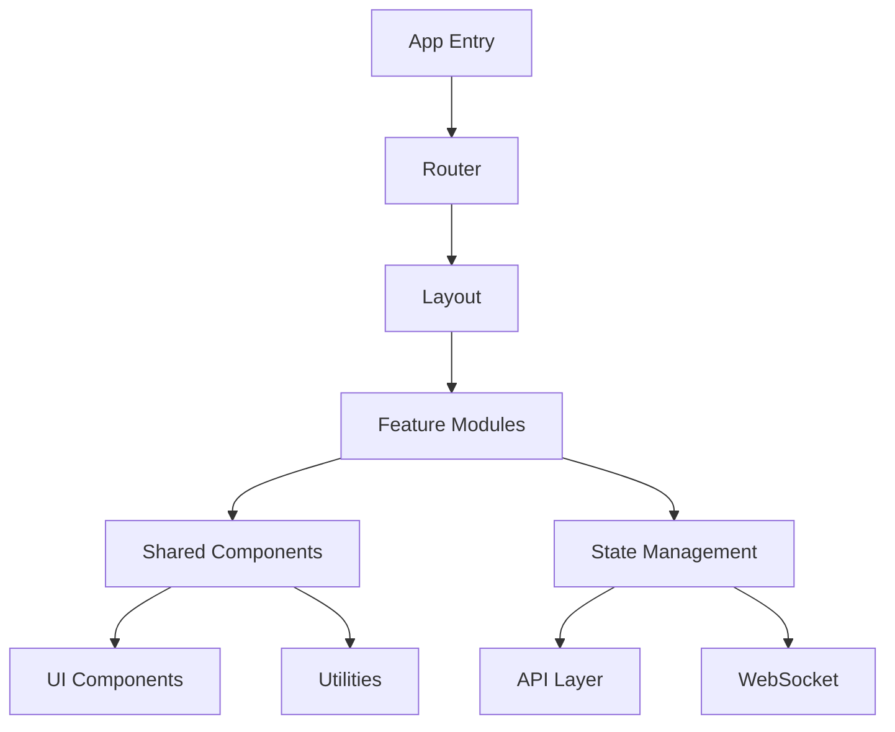

# AI-Powered Detection Platform Frontend

A modern, enterprise-grade React application for managing security detections with AI-powered capabilities.


## Project Overview

The AI-Powered Detection Platform frontend provides a sophisticated user interface for security teams to discover, share, and generate detection content. Built with React 18.2+ and TypeScript 5.0+, it delivers a seamless experience for managing security detections across multiple platforms.

### Key Features

- 🔍 Natural language search with AI-powered suggestions
- 📝 Advanced detection content editor with syntax highlighting
- 🔄 Real-time collaboration tools
- 📊 Interactive analytics dashboard
- 🌐 Cross-platform detection management
- 🔐 Enterprise-grade security controls
- 🌍 Internationalization support

### Architecture



## Getting Started

### Prerequisites

- Node.js 20.x LTS
- npm 9.x or yarn 1.22.x
- Docker 24.x (optional)

### Installation

1. Clone the repository:
```bash
git clone <repository-url>
cd src/web
```

2. Install dependencies:
```bash
npm install
```

3. Set up environment variables:
```bash
cp .env.example .env.local
```

4. Start development server:
```bash
npm run dev
```

### Available Scripts

- `npm run dev` - Start development server
- `npm run build` - Build production bundle
- `npm run test` - Run test suite
- `npm run lint` - Run ESLint checks
- `npm run format` - Format code with Prettier
- `npm run storybook` - Launch Storybook
- `npm run e2e` - Run Cypress E2E tests

## Development

### Project Structure

```
src/
├── assets/          # Static assets
├── components/      # Reusable UI components
├── features/        # Feature-specific modules
├── hooks/          # Custom React hooks
├── layouts/        # Page layouts
├── lib/            # Utility functions
├── services/       # API services
├── store/          # Redux store configuration
├── styles/         # Global styles
└── types/          # TypeScript definitions
```

### Code Quality

- TypeScript strict mode enabled
- ESLint with custom ruleset
- Prettier for consistent formatting
- Jest with React Testing Library
- Cypress for E2E testing
- Storybook for component documentation
- SonarQube integration
- Husky pre-commit hooks

### Design System

Following Material Design specifications:

- Typography:
  - Primary: Inter
  - Secondary: Roboto Mono
  - Scale: 12/14/16/20/24/32px

- Colors:
  - Primary: #1976D2
  - Secondary: #424242
  - Error: #D32F2F
  - Success: #388E3C

- Breakpoints:
  - Mobile: 360px
  - Tablet: 768px
  - Desktop: 1024px
  - Wide: 1440px

## Build and Deployment

### Production Build

```bash
npm run build
```

Build output will be in the `dist/` directory.

### Docker Support

```bash
docker build -t detection-platform-frontend .
docker run -p 80:80 detection-platform-frontend
```

### Environment Configuration

| File | Purpose |
|------|---------|
| .env.development | Development settings |
| .env.production | Production settings |
| .env.test | Test environment settings |
| .env.staging | Staging environment settings |
| .env.local | Local overrides (git-ignored) |

### Performance Optimization

- Code splitting with React.lazy()
- Image optimization with next/image
- Bundle size monitoring
- Lighthouse CI integration
- Service Worker for offline support
- Memory leak prevention
- React.memo() for expensive components

### Security Considerations

- HTTPS enforced
- CSP headers configured
- CSRF protection
- Input sanitization
- Secure cookie handling
- Regular dependency updates
- Security headers configured
- XSS prevention measures

## Contributing

1. Fork the repository
2. Create a feature branch
3. Commit your changes
4. Push to the branch
5. Create a Pull Request

### Commit Convention

Follow [Conventional Commits](https://www.conventionalcommits.org/):

```
feat: add new feature
fix: bug fix
docs: documentation updates
style: formatting changes
refactor: code restructuring
test: test updates
chore: maintenance tasks
```

## License

This project is licensed under the MIT License - see the LICENSE file for details.

## Support

For support, please contact:
- Email: support@detection-platform.com
- Slack: #detection-platform-support
- Documentation: [docs.detection-platform.com](https://docs.detection-platform.com)